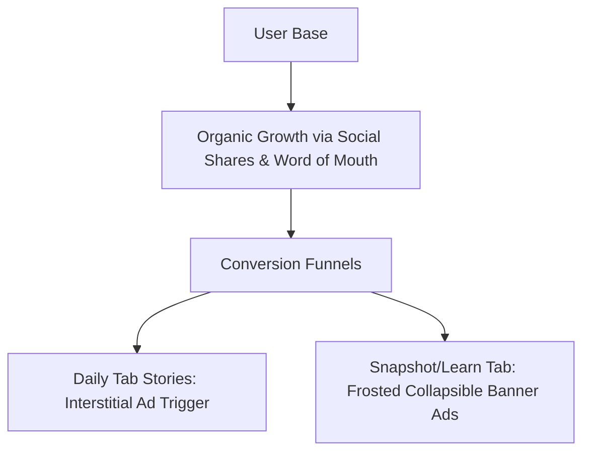

# Module 01: Personal Wealth App Revenue & Monetization Models

This document benchmarks local-first monetization strategies and details a sustainable, SEBI-compliant revenue framework tailored for an ad-supported, offline-first personal wealth application.

---

## 🧭 Executive Summary
To compete where INDmoney, Groww, and ET Money cannot—absolute visual simplicity, dynamic custom simulations, and complete offline privacy—our monetization strategy will bypass complex investment broker integrations and paid in-app purchases. Instead, we use an **ad-supported freemium model** using Google AdMob banner and interstitial placements, yielding steady, passive revenue from a highly engaged daily user base.

---

## 📉 Competitor Monetization Benchmarking

| Platform | Primary Model | Why We Do Not Compete | Our Strategy |
| :--- | :--- | :--- | :--- |
| **Groww / Zerodha** | Brokerage transaction fees (flat ₹20/order) + lending interest. | High regulatory barrier, expensive API integrations, massive infrastructure. | **No transaction execution**. Purely mathematical game simulations & manual ledger. |
| **INDmoney** | Brokerage, insurance distribution commission, premium advisory family tiers. | High data security and trust concerns (accessing user credit, SMS, bank accounts). | **Offline-only local storage**. No database, zero backend, complete privacy (no one sees their data). |
| **ET Money Genius** | SaaS Asset Allocation subscription (₹49 - ₹249/mo). | Requires constant portfolio rebalancing tracking and active data feeds. | **Snackable daily gameplay & manual monthly ledger** to hook friends, family, and casual users. |

---

## 💎 Ad-Supported Monetization Framework

Since the app has **zero backend servers** (resulting in a near-zero hosting run-rate), we do not need complex purchase verification systems or recurring subscriptions. Our monetization is strictly ad-based, ensuring 100% security against client-side receipt spoofing.

### 📱 1. Snackable Ad-Supported Engagement (Free Tier)
* **Daily Wealth Stories**:
  * Users open the app to read a snackable daily story (e.g., *"Rahul is 28..."*), cast their vote, and review the simulated compound outcome.
  * A single, clean native interstitial ad (via Google AdMob) is rendered when the user clicks "View Long-term Outcome". 
  * Since this loop takes under 60 seconds, it delivers high eCPM (effective Cost Per Mille) without irritating users with aggressive popups.
* **Standard Wealth Simulator & Calculators**:
  * Free access allows players to run the timeline simulator and sliders. 
  * Collapsible banner ads are anchored at the bottom of the Snapshot and Learn tabs, blending seamlessly into our frosted glassmorphic UI.

---

## ⚖️ SEBI Compliance Safeguards

Because we do not provide active stock picks or active financial advice, we are immune to SEBI advisory regulations:
1. **Educational Disclaimer**: Every calculator and game screen carries a premium, styled footnote: *"All models are for educational gamification purposes and do not represent financial advice. Returns are based on historical market averages."*
2. **Generalized Asset Categories**: Instead of tracking specific mutual funds or stocks, users manual input generalized asset totals (e.g., "Equity", "Gold", "Debt") with custom expected return rates. We serve as a smart math visualization sheet rather than an active advisory service.
