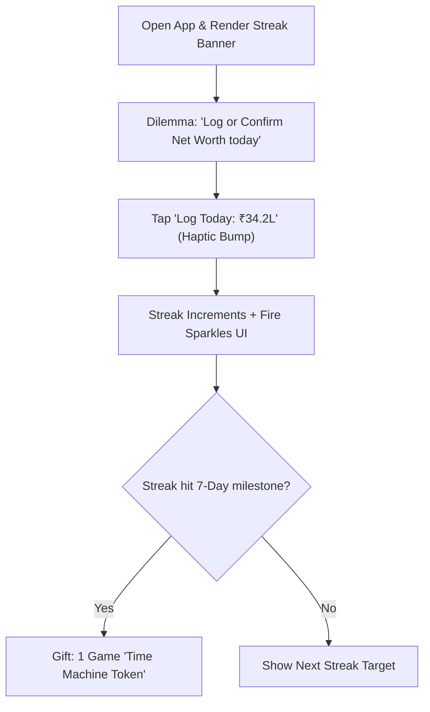

# Module 06: Net Worth Tracker & "Wealth Streak" Habit Loop

This document details the research, specifications, local storage models, and gamification psychology of the **Net Worth Tracker** and **Wealth Streak** engine.

---

## 🧭 Executive Summary
Most wealth trackers suffer from two issues: complex API bank integrations that compromise user privacy, and poor retention where users check their balances only during market rallies. To build a secure and addictive wealth co-pilot, we offer a **100% offline manual monthly ledger** coupled with a gamified daily **Wealth Streak** that encourages a daily routine of wealth awareness.

---

## 🚀 The Daily "Wealth Streak" Habit Loop

It sounds silly, but psychological streaks (Duolingo, Snapchat) are the most effective way to drive app retention. The **Wealth Streak** makes tracking your money a game:



### 1. Streak Rules & Mechanics
* **Daily Action**: The user must open the app and complete a simple action:
  * Option A: Tapping *"No change, confirm today's net worth is ₹XX Lakh"* (1-tap).
  * Option B: Modifying any asset total (e.g., adding ₹2,000 to Cash).
* **The 36-Hour Window**: To account for late-night logs or varying routine hours, the streak resets to zero only if no log occurs for **36 consecutive hours** (1.5 days).
* **The Flywheel Reward**: Maintaining streaks rewards the user. Every **7-day streak milestone** rewards the player with **1 "Time Machine Token"** for the **Indian Wealth Simulator Game**, driving active cross-retention!

### 2. Local State MMKV Schema
```typescript
interface AssetClass {
  id: string; // e.g. 'equity_mf'
  name: string; // e.g. 'Mutual Funds'
  value: number; // INR ₹
  customExpectedCagr: number; // e.g. 0.12 (12%)
  category: 'EQUITY' | 'DEBT' | 'CASH' | 'GOLD' | 'LIABILITY';
}

interface MonthlyNetWorthRecord {
  timestamp: number; // Year & Month
  totalValue: number;
  assets: AssetClass[];
}

interface StreakState {
  currentStreak: number;
  lastLoggedTimestamp: number; // unix time
  bestStreak: number;
}
```

---

## 💻 TypeScript Streak Validation Logic

This function runs on app startup to calculate if the streak is active, needs to be reset, or is successfully incremented.

```typescript
export const validateAndProcessStreak = (state: StreakState, isUserAction: boolean): { updatedState: StreakState; triggerReward: boolean; message: string } => {
  const now = Date.now();
  const oneDayMs = 24 * 60 * 60 * 1000;
  const gracePeriodMs = 36 * 60 * 60 * 1000; // 36 hours limit

  let { currentStreak, lastLoggedTimestamp, bestStreak } = state;
  let triggerReward = false;
  let message = "";

  if (lastLoggedTimestamp === 0) {
    // Brand new user streak start
    if (isUserAction) {
      currentStreak = 1;
      lastLoggedTimestamp = now;
      message = "First day logged! Your Wealth Streak begins.";
    }
  } else {
    const elapsed = now - lastLoggedTimestamp;

    if (elapsed > gracePeriodMs) {
      // Streak broken
      currentStreak = isUserAction ? 1 : 0;
      lastLoggedTimestamp = isUserAction ? now : 0;
      message = isUserAction ? "Streak was broken! New streak started today." : "Wealth Streak has reset.";
    } else if (elapsed <= gracePeriodMs && elapsed >= oneDayMs) {
      // Valid consecutive day update
      if (isUserAction) {
        currentStreak += 1;
        lastLoggedTimestamp = now;
        message = `Streak increased! Day ${currentStreak} of wealth logging.`;
        
        if (currentStreak > bestStreak) {
          bestStreak = currentStreak;
        }

        // Reward flywheel on every 7-day milestone
        if (currentStreak % 7 === 0) {
          triggerReward = true;
        }
      }
    } else {
      // Multiple logs inside the same day
      if (isUserAction) {
        lastLoggedTimestamp = now; // Update timestamp, but do not increment streak
        message = "Net worth updated again today! Streak is secured.";
      }
    }
  }

  return {
    updatedState: { currentStreak, lastLoggedTimestamp, bestStreak },
    triggerReward,
    message
  };
};
```

---

## 🎨 Premium Net Worth UI/UX Aesthetics

* **The Glassmorphic Ledger Dashboard**: Frosted panels display each categorized asset class with a colored dot matching its return rate:
  * Equity / Stocks: Neon Green (`#39FF14` at 12-15% CAGR).
  * Debt / FD: Steady Cyan (`#00FFFF` at 6-7% CAGR).
  * Gold: Gilded Gold (`#FFD700` at 8% CAGR).
  * Liabilities: Sunset Red (`#FF2E93`).
* **The "Compounding Engine" Projection**: An interactive line chart projecting their manual assets 5 years into the future using their custom assigned CAGRs, demonstrating the magic of silent compounding in real-time.
* **Duolingo-Style Fire Widget**: Render an active, glowing orange fire flame icon next to their profile displaying their streak count. If the streak is at risk of breaking (elapsed > 24 hours), the flame turns grey and pulses.
