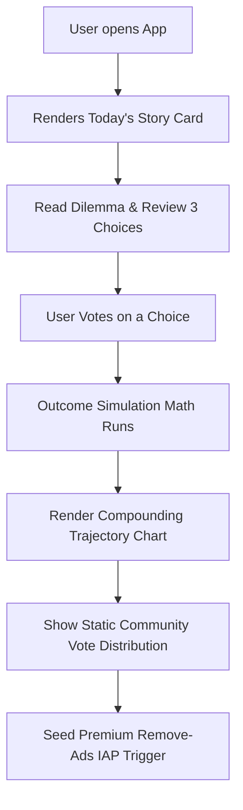

# Module 09: Daily Wealth Stories (Interactive Gamification)

This document researches, structures, and designs the **Daily Wealth Stories** feature, an interactive micro-game engine designed to drive daily user engagement and long-term financial awareness.

---

## 🧭 Executive Summary
To keep users coming back to the app daily without relying on annoying push notifications or complex stock tracking, we introduce **Daily Wealth Stories**. This feature mimics the addictive loops of text-choice games (like *Reigns* or *BitLife*) but isolates them into a 60-second daily dilemma. Users review a real-life Indian personal finance story, vote on a choice, and instantly witness the simulated long-term compound impact on a beautiful fintech chart.

---

## 🎮 Core Game Mechanics & User Flow



### 1. The Daily Choice Loop
1. **The Persona**: The app presents a snackable card representing a relatable character. E.g., *"Rahul is 28, earns ₹12 Lakh per year, and has ₹3 Lakh in mutual funds."*
2. **The Dilemma**: A real-life financial pivot. E.g., *"He wants to commute in style. He can either: A) Buy a ₹10 Lakh SUV on EMI, B) Buy a ₹5 Lakh pre-owned hatchback in cash, C) Skip the car and increase his index fund SIP."*
3. **The Interactive Vote**: The user taps their choice.
4. **The Impact Visualization**: Tapping a choice instantly fires a high-performance chart showing the character's projected net worth over the next 15 years based on the chosen path, contrasted against the other options.
5. **Zero-Cost Community Polls**: To show *"What other users voted"* without paying for expensive real-time databases, the app fetches a lightweight, static JSON file from a free CDN (e.g., GitHub Pages) once a day. This JSON contains the daily story text, choices, and realistic vote distributions (e.g., Option A: 12%, Option B: 38%, Option C: 50%), creating a sense of a living community at **zero backend hosting cost**.

---

## 📝 Sample Stories & Mathematical Outcomes

Below are three sample stories, mapping the mathematical choices that run in the local simulation engine.

### 🚗 Story 1: Rahul's Commute Decision (Age 28, Salary ₹1,00,000/month)
* **Context**: Rahul's monthly expenses are ₹40,000. He currently invests ₹30,000 in a SIP. He has ₹5 Lakh in cash savings.
* **Choices**:
  * **Option A (Buy Premium SUV on EMI)**: Buy a ₹10L SUV. Downpayment ₹2L. Car loan of ₹8L at 9.5% interest for 5 years. EMI is ₹16,800/month. Monthly SIP drops from ₹30,000 to ₹13,200. Fuel + maintenance adds ₹8,000/month, reducing SIP further to ₹5,200.
  * **Option B (Pre-owned Hatchback in Cash)**: Buy a ₹5L pre-owned car. Pay entirely in cash. Monthly cash savings are gone, but monthly SIP continues at ₹30,000. Fuel + maintenance adds ₹5,000/month, adjusting SIP to ₹25,000.
  * **Option C (No Car, Max SIP)**: Continue taking public transport. Increase SIP by ₹10,000/month (total ₹40,000/month).
* **Mathematical Outcome after 10 Years (Assuming 12% Equity CAGR)**:
  * **Option A Net Worth**: **₹42.3 Lakhs** (SUV depreciates to ₹2.5L).
  * **Option B Net Worth**: **₹64.8 Lakhs** (Pre-owned car depreciates to ₹1L).
  * **Option C Net Worth**: **₹92.1 Lakhs** (No car asset, but supreme compounding).
  * *The Chart visually "wows" the user by showing the ₹50 Lakh gap created by a single car decision over a decade!*

---

### 🏠 Story 2: Neha's Gurgaon Real Estate Dilemma (Age 32, Salary ₹1,50,000/month)
* **Context**: Neha has ₹20 Lakh in cash/liquid assets.
* **Choices**:
  * **Option A (Buy Premium Apartment)**: Buy a ₹1.2 Crore apartment. Downpayment ₹20L (all liquid cash wiped out). Home loan of ₹1 Crore at 8.75% for 20 years. Monthly EMI is ₹88,370. Remaining monthly salary goes entirely to living expenses. SIP is ₹0. Property appreciates at 6.5% annually.
  * **Option B (Rent Cozy Flat & Invest)**: Rent a similar apartment for ₹30,000/month. Keep ₹20L invested. Direct remaining monthly surplus (₹50,000/month) into an active mutual fund SIP (12% CAGR).
* **Mathematical Outcome after 15 Years**:
  * **Option A Net Worth (Property Value minus outstanding loan)**: Property appreciates to ₹3.08 Crore. Outstanding loan is ₹47.5 Lakhs. Net Equity: **₹2.6 Crore**.
  * **Option B Net Worth (SIP Portfolio)**: Liquid investments compound to **₹3.9 Crore** (Liquid cash).
  * *Neha's story highlights the mathematical realities of leverage vs rent-and-invest standard parameters in Indian Tier-1 cities.*

---

## 🎨 Premium UI/UX Design Concepts

Daily Wealth Stories rely heavily on high-end sensory feedback to make personal finance feel addictive and rewarding:

* **Tinder-style Choice Swipes (Reigns-inspired)**: The user is presented with a large, frosted glassmorphic card representing the persona. Dragging the card left, right, or up previews the choices.
* **Outcome Animation**: On voting, the card flips with a 3D rotation animation, transforming into a interactive spline chart. The chart features color-coded, glowing gradient curves representing the three options.
* **Brain Stimulation Elements**: Dynamic, celebratory micro-animations when the user selects the mathematically optimal path (e.g., small green sparklers or coin-clinking haptics).

---

## 📱 React Native Execution Technical Specifications

### 1. Database Model (Offline-First MMKV)
To track completed stories and user performance locally, save a simple JSON schema in MMKV:

```typescript
interface CompletedStory {
  storyId: string;
  votedOption: 'A' | 'B' | 'C';
  votedTimestamp: number;
  wasOptimalChoice: boolean;
}

interface UserStoryStats {
  totalStoriesPlayed: number;
  optimalChoicesCount: number;
  currentStreak: number;
  history: CompletedStory[];
}
```

### 2. Zero-Cost JSON Feeding Endpoint
The app makes a rapid, non-blocking `fetch()` call upon launch to update its offline daily story list:
`https://yourusername.github.io/wealth-stories/today.json`

```json
{
  "storyId": "story_2026_05_30",
  "characterName": "Rahul",
  "age": 28,
  "intro": "Rahul is 28 and earns ₹12 Lakh per year. He has ₹3 Lakh in savings and wants to buy a car to commute in Gurgaon.",
  "choices": {
    "A": "Buy a premium ₹10L SUV on a 5-year EMI.",
    "B": "Buy a pre-owned ₹5L hatchback in cash.",
    "C": "Skip the car and invest the cash into a mutual fund SIP."
  },
  "communityVotes": {
    "A": 0.15,
    "B": 0.35,
    "C": 0.50
  }
}
```
*If offline, the app falls back to a locally preloaded set of 30 classic stories, ensuring 100% offline usability.*
